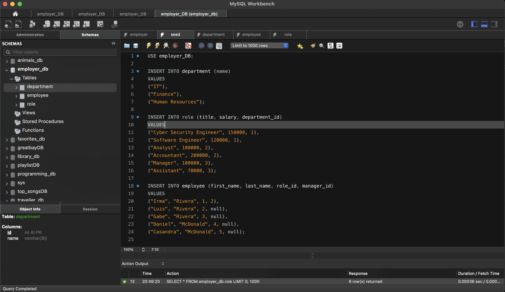
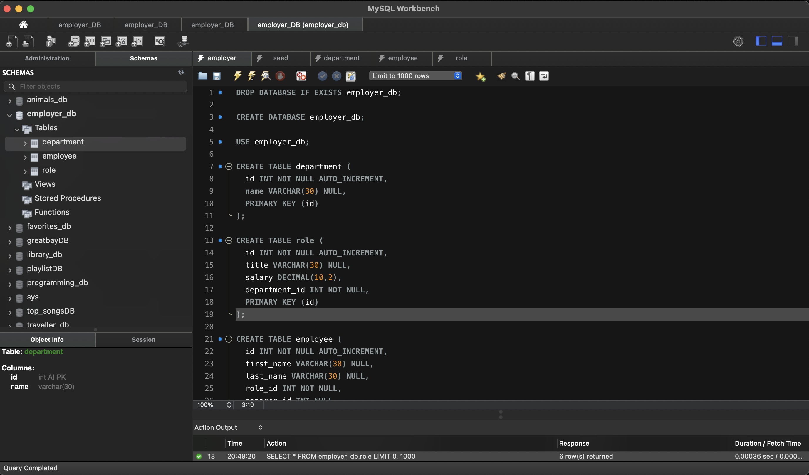

# Table of Contents:
* [Project Description](#Project)
* [Deployed Links](#Links)
* [Usage](#Usage)
* [Credits](#Credits)
* [License](#License)

# Project:
## Title:
# c12-Employee-Tracker

## Description:
A SQL Library that uses node and inquirer.

As for our twelfth week of homework for this assignment we (Columbia Engineering Bootcamp students) were given the following user story below and acceptance criteria:

## Requirements

```
As a business owner
I want to be able to view and manage the departments, roles, and employees in my company
So that I can organize and plan my business
```

## Acceptance Criteria

```
Developers are often tasked with creating interfaces that make it easy for non-developers to view and interact with information stored in databases. Often these interfaces are known as **C**ontent **M**anagement **S**ystems. In this homework assignment, your challenge is to architect and build a solution for managing a company's employees using node, inquirer, and MySQL.

Design the following database schema containing three tables:

* **department**:

  * **id** - INT PRIMARY KEY
  * **name** - VARCHAR(30) to hold department name

* **role**:

  * **id** - INT PRIMARY KEY
  * **title** -  VARCHAR(30) to hold role title
  * **salary** -  DECIMAL to hold role salary
  * **department_id** -  INT to hold reference to department role belongs to

* **employee**:

  * **id** - INT PRIMARY KEY
  * **first_name** - VARCHAR(30) to hold employee first name
  * **last_name** - VARCHAR(30) to hold employee last name
  * **role_id** - INT to hold reference to role employee has
  * **manager_id** - INT to hold reference to another employee that manages the employee being Created. This field may be null if the employee has no manager

Build a command-line application that at a minimum allows the user to:

  * Add departments, roles, employees

  * View departments, roles, employees

  * Update employee roles

Bonus points if you're able to:

  * Update employee managers

  * View employees by manager

  * Delete departments, roles, and employees

  * View the total utilized budget of a department -- ie the combined salaries of all employees in that department
```


## Config
Please add your user name and password to the config file. Also install npm packages needed to run this program.

## Link
Video coming soon.

#Usage
## Final screenshot



#Credits
Thank you to everyone in the Columbia Engineering Bootcamp.

#License
MIT License

Copyright (c) 2021 Casandra McDonald

Permission is hereby granted, free of charge, to any person obtaining a copy
of this software and associated documentation files (the "Software"), to deal
in the Software without restriction, including without limitation the rights
to use, copy, modify, merge, publish, distribute, sublicense, and/or sell
copies of the Software, and to permit persons to whom the Software is
furnished to do so, subject to the following conditions:

The above copyright notice and this permission notice shall be included in all
copies or substantial portions of the Software.

THE SOFTWARE IS PROVIDED "AS IS", WITHOUT WARRANTY OF ANY KIND, EXPRESS OR
IMPLIED, INCLUDING BUT NOT LIMITED TO THE WARRANTIES OF MERCHANTABILITY,
FITNESS FOR A PARTICULAR PURPOSE AND NONINFRINGEMENT. IN NO EVENT SHALL THE
AUTHORS OR COPYRIGHT HOLDERS BE LIABLE FOR ANY CLAIM, DAMAGES OR OTHER
LIABILITY, WHETHER IN AN ACTION OF CONTRACT, TORT OR OTHERWISE, ARISING FROM,
OUT OF OR IN CONNECTION WITH THE SOFTWARE OR THE USE OR OTHER DEALINGS IN THE
SOFTWARE.
